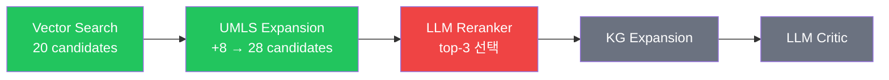
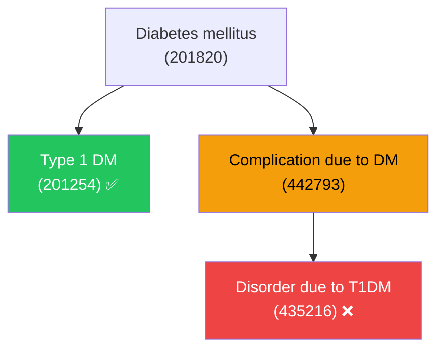

# Agent2 Pipeline — T1DM Case Study

**Case**: E-1 "No Type 1 Diabetes Mellitus"  
**GOLD Recall**: 19% — **어디서 문제가 발생하는가?**

<br>



| Step               | 435216 (Disorder due to T1DM)                | 상태 |
| ------------------ | -------------------------------------------- | :--: |
| **Vector Search**  | rank 6 / 20 (dist=0.233)                     |  ✅  |
| **UMLS Expansion** | position 6 / 28 (변화 없음)                  |  ✅  |
| **LLM Reranker**   | top-3에서 제외 — LLM이 subtype(1A,1B)만 선택 |  ❌  |

<!-- 임베딩은 이미 찾고 있지만 LLM Reranker에서 탈락 -->

---

layout: two-cols
layoutClass: gap-8

---

# OMOP 계층: Cross-Branch 문제



<span class="text-sm">

- `includeDescendants` → **아래로만** 확장
- 435216은 **다른 가지** (Complication)
- KG sibling도 부모가 달라 **도달 불가**

</span>

::right::

# Reranker 프롬프트

```text {class:'text-xs'}
System:
  Select up to 3 OMOP concepts
  that best match the user's
  clinical intent.

User:
  Clinical term:
  "Type 1 diabetes mellitus"
```

<br>

**LLM 선택** (top-3):

| #   | Concept                  |     |
| --- | ------------------------ | :-: |
| 1   | Type 1 DM                | ✅  |
| 2   | IDDM type 1A             | ✅  |
| 3   | IDDM type 1B             | ✅  |
| 4   | **Disorder due to T1DM** | ❌  |

<span class="text-sm opacity-70">→ "best match" 기준이라 합병증 계통 제외</span>

---

# 개선 방안 (RFC-010)

<br>

| 방안                     | 변경                                  | 효과             | 난이도 |
| ------------------------ | ------------------------------------- | ---------------- | :----: |
| **A. top_n 증가**        | `3 → 5`                               | 435216 포함 가능 |   ⭐   |
| **B. Exclusion context** | query에 "배제 조건" 맥락 전달         | LLM이 넓게 선택  |  ⭐⭐  |
| **C. 프롬프트 수정**     | "Include complications" 추가          | 전역 적용        |  ⭐⭐  |
| **D. Agent1 세분화**     | "T1DM" + "Complications of T1DM" 분해 | 근본 해결        | ⭐⭐⭐ |

<br>

### 💡 핵심 인사이트

> **Vector Search(임베딩)는 이미 cross-branch concept을 찾고 있다.**  
> 문제는 LLM Reranker가 "best match" 기준으로 **너무 좁게 필터링**하는 것.  
> **권장: B + A 조합** — exclusion context 전달 + top_n=5

<style>
blockquote { border-left: 4px solid #3b82f6; background: #1e293b; padding: 12px 16px; }
</style>
