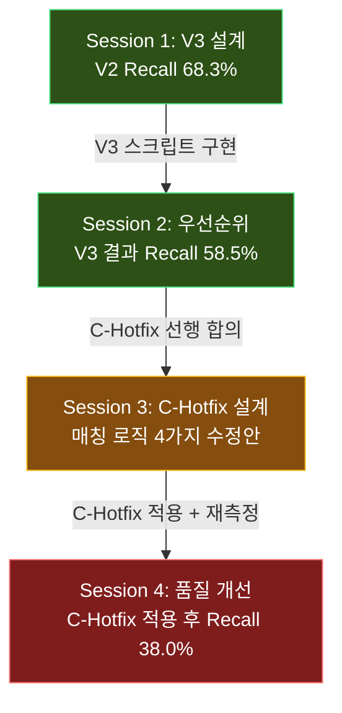

# Lab Meeting Records — ARTEMIS Benchmark Sprint

**기간**: 2026-02-16 ~ 2026-02-17  
**참여 모델**: Claude, Gemini (gemini-3-pro-preview), Codex (gpt-5.3-codex-spark)  
**프로토콜**: 3-모델 독립 제안 → 교차 검증(Devil's Advocate) → 합의 도출

---

## 📋 세션 목록

| # | 날짜 | 안건 | 핵심 결정 | 회의록 |
|---|------|------|----------|--------|
| 1 | 02-16 | [Benchmark V3 설계](#session-1-benchmark-v3-설계) | 2단계 평가 + Semantic Fingerprinting | [회의록](2026-02-16_benchmark_v3_design.md) |
| 2 | 02-16 | [다음 우선순위 결정](#session-2-다음-우선순위-결정) | C(Hotfix) → B → C(Deep) → A | [회의록](2026-02-16_benchmark_next_steps.md) |
| 3 | 02-16 | [C-Hotfix 구체 설계](#session-3-c-hotfix-구체-설계) | 4가지 코드 변경안 합의 | [회의록](2026-02-16_c_hotfix_design.md) |
| 4 | 02-17 | [파이프라인 품질 개선](#session-4-파이프라인-품질-개선) | Agent 3 안정화 → Agent 2 가드 기반 개선 | [회의록](2026-02-17_pipeline_quality_improvement.md) |

---

## 🔄 전체 흐름 (Decision Chain)



> [!NOTE]
> Recall이 68.3% → 58.5% → 38.0%으로 하락한 것은 **평가 범위 확대**에 따른 것임.
> V2는 Agent 2 concept set만 평가, V3는 전체 파이프라인(Agent 1→2→3)을 평가하며,
> C-Hotfix는 과대평가를 제거(unmatched TROY를 recall=0으로 포함)한 결과.

---

## 📌 세션별 요약

### Session 1: Benchmark V3 설계
**안건**: Agent 2 concept set 평가를 넘어 Agent 3 Circe JSON 전체 파이프라인 평가 체계 구축

**3모델 공통 발견**:
- WebAPI/SQL 경로 미존재 → Offline Python 우선
- TROY 단일 구현 편향 → Silver Ground Truth로만 사용
- JSON raw diff 무의미 → **Semantic Fingerprinting** 채택

**핵심 결정**:
1. 2단계 평가: Static Semantic Validation + Fingerprint 비교
2. `[CriteriaType]_[Table]_[ConceptSet]_[Window]` 형태 fingerprint
3. Offline Python 스크립트 우선 (WebAPI는 다음 스프린트)
4. TROY = Silver Ground Truth (절대 기준 아님)

---

### Session 2: 다음 우선순위 결정
**안건**: V3 Recall 58.5% 결과 기반 다음 스프린트 우선순위

**쟁점**: Agent 2 먼저(Claude) vs 벤치마크 로직 먼저(Gemini/Codex)

**합의**: **C(Hotfix) → B → C(Deep) → A**
- "부러진 자로 측정하면 수정 효과를 모른다" (Gemini) → 측정 도구 수정 선행
- 300줄 전체 재작성은 과도 → Hotfix(fuzzy+temporal)만 우선

---

### Session 3: C-Hotfix 구체 설계
**안건**: `benchmark_v3.py` 4가지 코드 변경안

| 변경 | 합의 내용 |
|------|----------|
| Window 정규화 | `window_group` property: `PRIOR/POST/OVERLAP/ANY_TIME/INDEX` |
| Name Fuzzy | stopword 제거 + `[TROY]` tag 제거 + 약어 alias 사전 |
| 매칭 전략 | Global Greedy 1:1 (score 기반, first-match에서 업그레이드) |
| Unmatched 처리 | recall=0으로 분모에 포함 → 과대평가 제거 |

**✅ 구현 완료**: `scripts/benchmark_v3.py` (698줄)에 모든 C-Hotfix 반영됨

---

### Session 4: 파이프라인 품질 개선
**안건**: C-Hotfix 적용 후 Full=13, Recall=38.0% → 실제 파이프라인 출력 품질 개선 방향

**합의**: Agent 3 방어적 안정화(cheap) → Agent 2 가드 기반 매핑 개선

| 순서 | 작업 | 예상 | 상태 |
|------|------|------|------|
| 1 | Agent 3: empty CS skip + warning log | 15분 | ⬜ |
| 2 | Agent 2: abbreviation expander 강화 | 30분 | ⬜ |
| 3 | Agent 2: 조건부 broad parent critic 프롬프트 | 30분 | ⬜ |
| 4 | E2E 재실행 + benchmark | 25분 | ⬜ |

**핵심 가드레일**:
- broad parent는 **조건부** (general category일 때만)
- abbreviation fallback은 **타입 안전** (충돌 시 블랙리스트)
- empty CS는 **skip+log** (fallback 생성 없이 안전 우선)

---

## 📂 디렉토리 구조

```
docs/lab_meetings/
├── README.md                              ← 이 파일 (종합 정리)
├── 2026-02-16_benchmark_v3_design.md      ← Session 1 회의록
├── 2026-02-16_benchmark_next_steps.md     ← Session 2 회의록
├── 2026-02-16_c_hotfix_design.md          ← Session 3 회의록
└── 2026-02-17_pipeline_quality_improvement.md ← Session 4 회의록

tmp/lab_meeting/                           (원본 제안/리뷰)
├── 20260216_benchmark_v3_design/          ← agenda, proposals(×3), cross_verify, reviews(×2)
├── 20260216_benchmark_next_steps/         ← agenda, proposals(×3), cross_verify, reviews(×2)
├── 20260216_c_hotfix_plan/                ← agenda, proposals(×3)
└── 20260217_pipeline_quality_improvement/ ← agenda, proposals(×2), cross_verify, review(×1)
```

---

## 📊 벤치마크 Recall 추이

```
V2 (Agent 2 only)  ████████████████████████████████████  68.3%
V3 (Full pipeline) ██████████████████████████████        58.5%
V3 + C-Hotfix      ███████████████████                   38.0%
                    0%        25%        50%        75%   100%
```

> [!IMPORTANT]
> 38.0%은 **보정된(de-inflated) 수치**이며, 과대평가가 제거된 실제 성능.
> 다음 단계(Session 4 실행 계획)를 통해 개선 예정.

---

## 🔗 관련 파일

| 파일 | 설명 |
|------|------|
| [benchmark_v3.py](file:///Users/kyh/Workspace/Broadsea/artemis/scripts/benchmark_v3.py) | V3 벤치마크 스크립트 (C-Hotfix 적용 완료, 698줄) |
| [verify_leader_design_e2e.py](file:///Users/kyh/Workspace/Broadsea/artemis/scripts/verify_leader_design_e2e.py) | E2E 검증 스크립트 |
| [TROY LEADER v3.4](file:///Users/kyh/Workspace/Broadsea/artemis/data/sample/LEADER) | TROY reference cohort JSON |
| [assembler.py](file:///Users/kyh/Workspace/Broadsea/artemis/src/agents/agent3/assembler.py) | Agent 3 Circe JSON builder |
| [c_hotfix_review_prompt.md](file:///Users/kyh/Workspace/Broadsea/artemis/tmp/c_hotfix_review_prompt.md) | Codex 리뷰 프롬프트 (매칭 갭 분석) |
