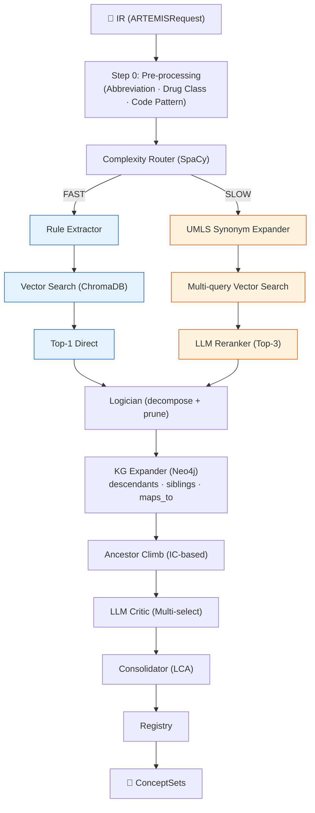

# Mapping Agent (Agent 2) — 상세 설명서

> 최종 업데이트: 2026-03-04  
> 상태: Living Document — 질문에 따라 지속 업데이트

---

## 1. 개요

**Mapping Agent (Agent 2)**는 ARTEMIS 파이프라인에서 **임상 텍스트를 OMOP Standard Concept ID로 변환**하는 핵심 에이전트이다. Trial Agent(Agent 1)가 출력한 Internal Representation(IR)의 각 기준(criteria)을 받아, 의료 용어 표준화(Semantic Mapping)를 수행한다.

### 핵심 역할

```
자연어 임상 기준 → OMOP Concept IDs (ConceptSet)
```

예시:

- `"Type 2 diabetes mellitus"` → Concept ID `201826`
- `"DPP-4 inhibitors"` → `[40239216, 40166035, 43013884, ...]` (개별 성분)
- `"HbA1c > 6.5%"` → Rule-based extraction (측정값으로 처리)

### 파이프라인 위치

```
Agent 1 (Trial) → [IR] → Agent 2 (Mapping) → [ConceptSets] → Agent 3 (Assembler) → Circe JSON
```

---

## 2. 아키텍처 개요

Agent 2는 **6단계 파이프라인**으로 구성된다:



---

## 3. 소스 코드 구조

| 파일                                                                      | 역할                                                            | 크기 |
| ------------------------------------------------------------------------- | --------------------------------------------------------------- | ---- |
| [workflow.py](../src/agents/agent2/workflow.py)                           | **메인 오케스트레이터** — Fast/Slow Path 분기 및 전체 흐름 제어 | 717L |
| [complexity_router.py](../src/agents/agent2/complexity_router.py)         | 복잡도 분류 (SpaCy NLP 기반 Fast/Slow 결정)                     | 363L |
| [retriever.py](../src/agents/agent2/retriever.py)                         | ChromaDB 벡터 검색 + 도메인별 보정 점수                         | 224L |
| [reranker.py](../src/agents/agent2/reranker.py)                           | LLM 기반 Top-N 리랭킹 (single + batch)                          | 327L |
| [kg_expander.py](../src/agents/agent2/kg_expander.py)                     | **Neo4j KG-RAG** — IC 기반 Ancestor Climbing + 개념 확장        | 657L |
| [critic.py](../src/agents/agent2/critic.py)                               | LLM Multi-select Critic (KG 확장 결과 필터링)                   | 265L |
| [umls_synonym_expander.py](../src/agents/agent2/umls_synonym_expander.py) | UMLS 동의어 확장 (로컬 MRCONSO SQLite)                          | 256L |
| [abbreviation_expander.py](../src/agents/agent2/abbreviation_expander.py) | 의학 약어 사전 기반 확장 (150+ 약어)                            | 244L |
| [drug_class_expander.py](../src/agents/agent2/drug_class_expander.py)     | 약물 클래스 → 개별 성분 확장 (ATC 기반, RFC-006)                | 301L |
| [rule_extractor.py](../src/agents/agent2/rule_extractor.py)               | Rule-based 추출기 (Demographics, Measurements)                  | 242L |
| [logic.py](../src/agents/agent2/logic.py)                                 | Logician — 복합 개념 분해 + pruning                             | 82L  |
| [regex_rules.py](../src/agents/agent2/regex_rules.py)                     | Regex 패턴 정의                                                 | 30L  |
| [agent2_cache.py](../src/agents/agent2/agent2_cache.py)                   | 캐시 관리 (디스크 기반)                                         | 95L  |

---

## 4. 상세 파이프라인

### 4.1 Step 0: Pre-processing

입력 텍스트를 정규화하고 특수 케이스를 사전 처리한다.

| 전처리기                  | 설명                    | 예시                                                  |
| ------------------------- | ----------------------- | ----------------------------------------------------- |
| **Abbreviation Expander** | 의학 약어 → 전체 명칭   | `T2DM` → `Type 2 diabetes mellitus`                   |
| **Drug Class Expander**   | 약물 클래스 → 개별 성분 | `DPP-4 inhibitors` → `[alogliptin, linagliptin, ...]` |
| **Code Pattern Matcher**  | 코드 패턴 감지          | `ICD-10: E11.65` → code-based lookup                  |

> **Drug Class Expander**는 RFC-006에 의해 **ATC Vocabulary 기반**으로 전환되었다. 하드코딩된 사전은 fallback으로만 사용.

### 4.2 Complexity Router

**SpaCy NLP**를 사용하여 각 기준(criteria)의 복잡도를 판단하고, **Fast Path** 또는 **Slow Path**로 분기한다.

#### 분류 기준

| 경로          | 조건                                                 | 소요 시간 |
| ------------- | ---------------------------------------------------- | --------- |
| **Fast Path** | 단일 noun phrase, 명확한 의학 용어, 논리 연산자 없음 | <100ms    |
| **Slow Path** | 복합 조건, 부정 표현, 시간 제약, 다의어 등           | 1-3s      |

#### Slow Path 트리거 패턴

```python
# complexity_router.py 내 주요 복잡도 지표
COMPLEX_PATTERNS = {
    "negation": ["no history of", "without", "absence of"],
    "exception": ["unless", "except", "other than"],
    "temporal": ["within 30 days", "prior to", "during"],
    "quantitative": [">= 6.5%", "between X and Y"],
    "ambiguous_terms": ["insult", "culture", "discharge", "block"],
}
```

#### SpaCy 분석

- **Noun chunk 수** > 3 → 복합 표현 가능성
- **ROOT verb 수** ≥ 2 → 복잡한 문장 구조
- **NER entity 수** → 다중 의학 개념 포함 여부

### 4.3 Fast Path (단순 용어)

LLM을 사용하지 않는 빠른 경로:

```
Query Text → Rule Extractor → Vector Search (ChromaDB) → Top-1 Direct → Logician → KG-RAG Post-processing
```

1. **Rule Extractor**: Regex 기반으로 나이, 성별, 측정값 등 구조화된 정보 추출
2. **Vector Search**: ChromaDB에서 의미적 유사도 기반 후보 검색 (fetch=60, return=20)
3. **Post-retrieval Scoring**: 벡터 거리(distance)를 기본으로 5단계 보정 점수 적용
4. **Top-1 선택**: 가장 낮은 adjusted_score를 가진 단일 후보 선택
5. **Logician**: 복합 개념 분해 + pruning (상세 아래)

#### Logician (ConceptLogician) 상세

Fast/Slow 양쪽에서 KG-RAG 전에 실행되는 후처리 모듈.

**① `decompose_combination(concept_id)`** — 복합 약물 → 개별 성분 분해

```sql
-- concept_ancestor 테이블에서 Ingredient 레벨 ancestor를 조회
SELECT ancestor_concept_id
FROM {schema}.concept_ancestor ca
JOIN {schema}.concept c ON c.concept_id = ca.ancestor_concept_id
WHERE ca.descendant_concept_id = :cid
  AND c.concept_class_id = 'Ingredient'
```

예시: `Metformin/Sitagliptin` (복합약) → `[Metformin, Sitagliptin]` (개별 성분 IDs)

**② `prune_empty_concepts(concept_ids)`** — CDM에 없는 개념 제거

현재는 **중복 제거(dedup)만 수행** (TODO: 도메인별 patient data 존재 여부 확인 예정)

**③ Graceful Fallback**

PostgreSQL 연결 실패 시 분해/pruning을 **스킵**하고 원본 concept_id를 그대로 반환한다. DB 가용성은 최초 1회만 체크 후 캐시.

#### Vector Search Post-retrieval Scoring 상세

`adjusted_score = distance + modifiers` (낮을수록 좋음)

**① Vocabulary 선호도 (도메인별)**

| Domain      | 선호 Vocabulary                                | 보정값      |
| ----------- | ---------------------------------------------- | ----------- |
| Condition   | SNOMED: **-0.05**, ICD10CM: 0.0                | 기타: +0.05 |
| Drug        | RxNorm: **-0.05**, RxNorm Ext: -0.02, ATC: 0.0 | 기타: +0.05 |
| Measurement | LOINC: **-0.15**, SNOMED: +0.10                | 기타: +0.05 |
| Procedure   | SNOMED: **-0.05**, CPT4: -0.03, HCPCS: 0.0     | 기타: +0.05 |

**② Exact / Substring 매칭 부스트**

| 매칭 유형       | 조건                                         | 보정값    |
| --------------- | -------------------------------------------- | --------- |
| Exact match     | `concept_name == query`                      | **-0.15** |
| Query in name   | `"diabetes" in "Type 2 diabetes mellitus"`   | **-0.08** |
| Name in query   | `"stroke" in "history of stroke"`            | **-0.04** |
| Word-stem match | 6+자 공통 prefix (e.g., `hypertens-ion/ive`) | **-0.06** |

**③ Concept Class 선호도**

| Domain      | 선호 Class (−0.03)               | 페널티 Class (+0.05)               |
| ----------- | -------------------------------- | ---------------------------------- |
| Condition   | Disorder, Clinical Finding       | Qualifier Value, Context-dependent |
| Drug        | Ingredient, Clinical Drug (Comp) | Observable Entity, Record Artifact |
| Measurement | Clinical Observation, Lab Test   | Staging/Scales, Attribute          |

> 페널티는 concept_name이 query와 exact/substring 매치인 경우 **면제**

**④ Domain Mismatch 페널티**

domain_hint가 주어졌을 때, 후보의 domain이 다르면 **+0.20** 강한 페널티

**⑤ Common Concept Boost (Data-Driven)**

`resources/concept_priority_defaults.json` + `concept_priority_db.json`에서  
CDM 데이터 빈도 기반 가중치를 로드하여 신뢰할 수 있는 개념에 부스트 적용

### 4.4 Slow Path (복합 용어)

LLM을 활용한 정밀 경로:

```
Query Text → UMLS Synonym Expansion → Multi-query Vector Search → LLM Reranker (Top-3) → Force Top-1 → Logician
```

1. **UMLS Synonym Expander**:
   - 로컬 SQLite (MRCONSO.RRF 기반)에서 동의어 검색
   - Exact match → LIKE fallback
   - 우선 어휘: SNOMEDCT_US, ICD10CM, RXNORM, NCI, MeSH
   - 최대 5개 동의어 반환

2. **Multi-query Vector Search**:
   - 원본 쿼리 + UMLS 동의어들을 **병렬**로 ChromaDB 검색
   - 결과를 합산하여 candidate pool 확장
   - 중복 제거 후 상위 후보 추출

3. **LLM Reranker (Top-N)**:
   - LangChain 기반 LLM 호출
   - 후보들의 임상적 적합성을 평가하여 Top-3 선택
   - Batch 처리 지원 (`rerank_topn_batch`, max_concurrency=5)

4. **Force Top-1 Inclusion**: 항상 최소 1개의 seed concept을 보장

5. **Logician**: Fast Path와 동일한 후처리

### 4.5 KG-RAG Post-processing

Fast/Slow Path 결과(seed IDs)를 **Knowledge Graph**를 통해 확장한다.

```
Seed IDs → KG Expander (Neo4j) → LLM Critic (Multi-select) → Final Concept IDs
```

#### KG Expander (Neo4j)

OMOP Concept 계층 구조를 활용한 개념 확장:

| 전략             | 설명                                               |
| ---------------- | -------------------------------------------------- |
| `descendants`    | 하위 개념 탐색 (e.g., Stroke → 뇌출혈, 뇌경색)     |
| `siblings`       | 형제 개념 탐색 (같은 부모, semantic reversal 해결) |
| `maps_to`        | 'Maps to' 관계로 연결된 개념                       |
| `ancestor_climb` | **IC 기반 상위 개념 등반** (핵심 전략)             |
| `clinical`       | 위 전략들의 조합 (기본값)                          |

#### Ancestor Climbing (IC 기반)

```python
# Information Content 계산
IC(c) = -log2(descendants(c) / TOTAL_STANDARD_CONCEPTS)
# TOTAL_STANDARD_CONCEPTS = 2,750,364

# IC 임계값
IC_THRESHOLD = 8.0  # descendants < ~10,700
```

**알고리즘**:

1. Seed concept에서 **위로 올라감** (Neo4j ancestors)
2. 각 ancestor의 **descendant count를 PostgreSQL**에서 조회 (정확도 위해)
3. IC > 8.0인 ancestor를 선택 (너무 일반적이지 않은 수준)
4. 선택된 ancestor에서 **아래로 내려가며** descendants 확장
5. 도메인 필터 적용 (Drug/Condition별 adaptive limits)

> **Hybrid 접근 방식**: Neo4j는 `sep ≤ 3` 엣지만 로드되어 있어 descendant count가 불완전. 따라서 IC 계산은 **PostgreSQL `concept_ancestor`** 테이블을 사용한다.

#### LLM Critic (Multi-select)

Reranker와 달리, Critic은 **각 후보를 독립적으로 평가**하여 관련된 **모든** 개념을 선택한다:

- **Reranker**: Single-select (하나의 best match 선택)
- **Critic**: Multi-select (관련된 모든 개념 선택/거부)

```python
# Critic 출력 구조
CriticResult:
    selected_concepts: [
        CriticSelection(concept_id=..., relevant=True/False, reasoning="...")
    ]
    overall_reasoning: "..."
```

KG 확장이 실패하면 seed IDs로 fallback한다.

### 4.6 Domain-Adaptive Limits

KG 확장 시 도메인별로 다른 limit을 적용한다:

| Domain    | KG Limit | 이유                                   |
| --------- | -------- | -------------------------------------- |
| Drug      | 15       | 약물 계층이 넓어 과도한 확장 방지      |
| Condition | 40       | 질병 분류가 세밀하여 더 많은 후보 필요 |
| Default   | 20       | 기타 도메인                            |

---

## 5. 데이터 흐름

### 입력 (from Agent 1)

```python
# ARTEMISRequest IR 구조 (관련 필드만)
class ARTEMISRequest:
    treatment: CriteriaItem        # 치료군 정의
    comparator: CriteriaItem       # 대조군 정의
    outcome: CriteriaItem          # 결과 정의
    inclusion_rules: List[Rule]    # 포함 기준
    exclusion_rules: List[Rule]    # 제외 기준
    measurement_rules: List[Rule]  # 측정값 기준
```

### 출력

```python
class MappingResult:
    concept_ids: List[int]         # 매핑된 OMOP Concept IDs
    gap_report: GapReport          # 매핑 실패 보고서
    routing_stats: Dict            # Fast/Slow 경로 통계
    processing_time: float         # 처리 시간
    confidence: float              # 신뢰도 점수
```

### Gap Report (매핑 실패 추적)

매핑에 실패한 기준을 추적하여 수동 검토를 가능하게 한다:

```python
class GapItem:
    original_text: str       # 원본 텍스트
    domain: str              # 기대 도메인
    failure_reason: str      # 실패 사유
    confidence: float        # 실패 확신도

# 실패 사유 유형
FAILURE_REASONS = [
    "NO_CANDIDATES",       # 벡터 검색 결과 없음
    "RERANKER_REJECTED",   # LLM 리랭커가 모든 후보 거부
    "PRUNED_EMPTY",        # Logician 이후 유효 개념 없음
]
```

---

## 6. 외부 의존성

| 시스템                       | 용도                                   | 필수 여부                            |
| ---------------------------- | -------------------------------------- | ------------------------------------ |
| **ChromaDB**                 | 벡터 검색 (`omop_concepts` collection) | ✅ 필수                              |
| **Neo4j**                    | KG-RAG 개념 확장 (OMOP hierarchy)      | ✅ 필수                              |
| **PostgreSQL** (Broadsea)    | IC 계산용 descendant count 조회        | ✅ 필수                              |
| **UMLS SQLite** (MRCONSO)    | 동의어 확장                            | ⚠️ 선택 (없으면 graceful degrade)    |
| **LLM** (Claude/GPT)         | Reranker + Critic                      | ✅ 필수                              |
| **SpaCy** (`en_core_web_sm`) | Complexity Router NLP 분석             | ⚠️ 선택 (없으면 rule-based fallback) |

---

## 7. 핵심 설계 결정 (ADR/RFC 참조)

| 결정                            | 문서                                                                  | 요약                                                |
| ------------------------------- | --------------------------------------------------------------------- | --------------------------------------------------- |
| UMLS Synonym Expansion          | [ADR-012](./adr/ADR-012_UMLS_Synonym_Expansion.md)                    | UMLS `sabs` 미사용, Broad Search                    |
| Common Concept Boosting         | [ADR-011](./adr/ADR-011_Agent2_Common_Concept_Boosting.md)            | 일반적인 개념에 가중치 부여                         |
| ATC Drug Class Expansion        | [RFC-006](./rfc/RFC-006_Vocabulary_Based_Drug_Class_Expansion.md)     | 하드코딩 사전 → ATC vocab 기반 (✅ 구현)            |
| KG+RAG Concept Expansion        | [RFC-003](./rfc/RFC-003_KG_RAG_Agent2_Concept_Expansion.md)           | Neo4j 기반 KG-RAG 도입                              |
| Neo4j Full Transitive Closure   | [ADR-018](./adr/ADR-018_Neo4j_Full_Transitive_Closure.md)             | Neo4j에 전체 concept 계층 로드                      |
| Reranker Cross-Branch Recall    | [RFC-010](./rfc/RFC-010_Reranker_Cross_Branch_Recall.md)              | 리랭커 cross-branch 탈락 방지                       |
| Lightweight Critic Distillation | [RFC-009](./rfc/RFC-009_Lightweight_Critic_Distillation.md)           | LLM Critic 경량화                                   |
| ATC Threshold & Metadata Lookup | [ADR-022](./adr/ADR-022_ATC_Threshold_And_Concept_Metadata_Lookup.md) | ATC dist threshold 1.2→0.9, DB metadata lookup 도입 |

---

## 8. 배치 처리 (Batch Processing)

Agent 2는 **Pattern 4: Batch Processing**을 지원한다:

```python
# 배치 API
workflow = Agent2Workflow()
result = workflow.process_batch(
    queries=["Type 2 diabetes", "Metformin", "HbA1c"],
    contexts=["diabetes trial", "diabetes trial", "lab test"]
)
```

배치 처리 흐름:

1. 전체 쿼리를 `batch_classify()`로 Fast/Slow 분류
2. Fast Path 쿼리: 순차 처리 (LLM 호출 없으므로 빠름)
3. Slow Path 쿼리: `_slow_path_batch()`로 **병렬** 처리
   - UMLS 확장 + Vector 검색 병렬화
   - `rerank_topn_batch()` — LLM 리랭킹 병렬 호출 (max_concurrency=5)
   - KG 확장 + Critic 평가도 쿼리별 병렬

---

## 9. 캐싱 전략

| 캐시 유형        | 저장 위치                  | 용도                                                   |
| ---------------- | -------------------------- | ------------------------------------------------------ |
| **KG Cache**     | `data/cache/kg_cache.json` | Neo4j 확장 결과 캐시 (concept_id + strategy → results) |
| **Agent2 Cache** | `agent2_cache.py`          | 전체 매핑 결과 캐시                                    |

---

## 10. 벤치마크 성능

> [종합 보고서](./experiments/BENCHMARK_CONSOLIDATED_REPORT.md) 참조

| 실험                 | 입력                           | Recall    | Precision | F1  |
| -------------------- | ------------------------------ | --------- | --------- | --- |
| M-TROY (A_direct v3) | Rule Names (GOLD)              | **83.1%** | -         | -   |
| A+Climb              | Rule Names + Ancestor Climbing | **53.8%** | -         | -   |

### 10.1 GOLD → Agent 2 Remap 실험 (2026-03-05)

GOLD JSON의 **56개 concept set name을 그대로** Agent 2에 입력하여 concept ID를 재매핑한 후, 원본 GOLD와 비교한 결과.

#### Concept 수 비교

| Concept Set                   | GOLD (수동) | Agent 2    | 배율   | 원인                                 |
| ----------------------------- | ----------- | ---------- | ------ | ------------------------------------ |
| liraglutide                   | 1           | 16         | 16x    | KG descendants (Saxenda, Victoza 등) |
| hypertension                  | 1           | **104**    | 104x   | Ancestor climb → 대량 descendants    |
| Stroke                        | 9           | **100**    | 11x    | 〃                                   |
| History of malignant neoplasm | 2           | **100**    | 50x    | 〃                                   |
| ischemic heart disease        | 31          | 43         | 1.4x   | 정상 범위                            |
| Insulin                       | 19          | 31         | 1.6x   | 정상 범위                            |
| GLP-1 receptor agonists       | 6           | 6          | 1.0x   | Drug class → ATC 매치 (정상)         |
| DPP4 inhibitors               | 10          | 8          | 0.8x   | 정상                                 |
| **전체**                      | **~217**    | **~1,300** | **6x** | —                                    |

#### Cohort 실행 결과

| 입력          | ConceptSets | Concepts | Cohort 결과               |
| ------------- | ----------- | -------- | ------------------------- |
| GOLD 원본     | 56          | ~217     | **2명** (60초 이내)       |
| Agent 2 Remap | 56          | ~1,300   | **Timeout** (1800초 초과) |

#### 근본 원인

TROY/GOLD는 **상위 concept 1-2개** + `includeDescendants: true`로 descendants를 WebAPI SQL에 위임한다. Agent 2는 KG Expansion에서 descendants를 **직접 나열**하여 concept items에 넣는다. 결과적으로:

- **같은 의미**를 표현하는데 concept 수만 6배 폭발
- `includeDescendants: true`가 이미 붙어있으므로 나열된 descendants의 또 descendants까지 펼쳐져 SQL이 기하급수적으로 커짐
- **Recall은 개선되지 않고 Precision만 하락**하는 구조

#### 시사점

Agent 2의 KG Expansion 전략을 **Ingredient/Clinical Finding 수준의 상위 concept만 반환**하도록 변경하고, descendant 확장은 Circe JSON의 `includeDescendants: true`에 위임하는 방식이 필요하다. 이는 Recall 유지 + Precision 향상 + WebAPI 성능 개선을 동시에 달성할 수 있다.

## 11. 알려진 제한사항

1. **KG Expansion 과잉 확장 → Precision 저하**: KG Expander + Ancestor Climb이 descendant를 과도하게 포함하여 concept 수가 폭발한다. GOLD 기준 217개 concept → Agent 2 매핑 시 **1,300+개**로 6배 이상 증가. Precision이 낮아지고 WebAPI cohort SQL도 timeout 유발. TROY는 상위 Ingredient/Clinical Finding 1-2개만 매핑하고 `includeDescendants: true`로 descendants를 WebAPI에 위임하는 방식이 더 효율적이다.
2. **ATC Drug Class Expansion False Match** (ADR-022): 개별 약물("Liraglutide")이 ATC drug class collection에서 전혀 다른 class("Lithium", dist=1.11)로 매칭되는 버그. `distance_threshold`를 1.2 → 0.9로 강화하여 수정했으나, 근본적으로 **개별 약물 vs 약물 클래스**를 구분하는 로직이 부재하다.
3. **Cross-branch Recall 손실**: Reranker가 Top-N 선택 시 관련 branch의 개념을 탈락시킬 수 있음 ([T1DM case study](./experiments/Agent2_T1DM_Pipeline_Analysis.md))
4. **General-purpose Embedding 한계**: BioLinkBERT 기반 임베딩이 OMOP-specific 관계를 충분히 포착하지 못함
5. **Drug Domain Guardrail 필요**: 약물 클래스 확장 시 과도한 확장 방지 로직 필요 ([Lab Meeting 2026-03-04](./lab_meetings/2026-03-04_exp_d_precision_recovery.md))
6. **Polarity 손실**: Agent 1에서 ABSENCE 태깅이 Agent 2로 전달되지 않는 경우 존재

---

## 12. FAQ

> 이 섹션은 질문에 따라 지속 업데이트됩니다.

### Q1. Critic이 최종적으로 1개만 뽑나요?

**아닙니다. Critic은 Multi-select 방식으로, relevant한 개념을 모두 선택합니다.**

Reranker와 Critic의 차이:

| 컴포넌트     | 선택 방식           | 역할                                                         |
| ------------ | ------------------- | ------------------------------------------------------------ |
| **Reranker** | Single/Top-N select | 벡터 검색 후보 중 **최대 3개** seed 선택                     |
| **Critic**   | **Multi-select**    | KG 확장 후보 각각을 독립 평가, **relevant=True인 전부** 반환 |

예시 흐름:

1. Reranker가 Top-3 seed 선택 (e.g., `[4329847, 316139, 321588]`)
2. KG Expander가 각 seed에서 descendants/siblings 확장 → 30개 후보
3. **Critic이 30개를 각각 평가** → relevant=True인 12개를 최종 반환

따라서 하나의 query에 대한 최종 출력은 **1개~수십 개**의 Concept ID가 될 수 있다.

### Q2. Fast Path에서는 KG expansion 안 하나요?

**합니다.** KG-RAG Post-processing은 Fast/Slow **양쪽 모두**에 적용된다.

```python
# workflow.py (process_with_details 내부)
if route_path == "fast":
    concept_ids = self._fast_path(query_text, ...)
else:
    concept_ids = self._slow_path(query_text, ...)

# ── KG-RAG Post-processing (both fast & slow) ──
concept_ids = self._kg_expand_and_critique(
    concept_ids, query_text, context, domain_hint
)
```

Fast/Slow의 차이는 **seed concept을 찾는 방식**뿐이고, seed를 찾은 이후의 KG 확장 + Critic 평가는 동일하게 수행된다.

---

## 관련 문서

- [Mapping Agent Diagram Guide](./mapping_agent_diagram_guide.md) — 아키텍처 다이어그램 작성 가이드
- [MOC](./MOC.md) — 전체 문서 목록
- [spec.md](./spec.md) — ARTEMIS 전체 사양서
