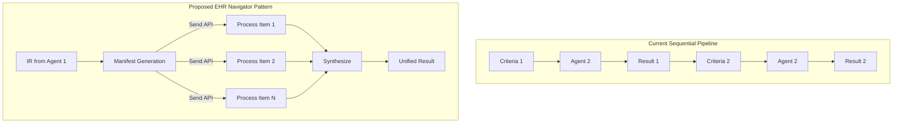

# RFC-002: EHR Navigator Pattern (Map-Reduce)

**상태**: 검토 중
**날짜**: 2026-02-05
**제안자**: @artemis-agent

## 1. 가설 및 목표

### 배경
현재 ARTEMIS v3.1의 파이프라인은 **순차적으로 각 criteria를 처리**합니다:
```
criteria_1 → Agent2 → result_1
criteria_2 → Agent2 → result_2
...
criteria_n → Agent2 → result_n
```

이 접근은 단순하지만, n개의 criteria가 있을 때 **O(n) × LLM_latency**의 처리 시간이 소요됩니다.

### 목표
`artemis_agent`에서 검증된 **EHR Navigator Pattern**을 도입하여:
1. **Manifest-Based Discovery**: 전체 criteria 목차를 먼저 생성하여 처리 계획 수립
2. **Map-Reduce 병렬 처리**: LangGraph Send API로 criteria 병렬 처리
3. **결과 통합(Reduce)**: 개별 결과를 통합하여 최종 ConceptSet 생성

**성공 기준**:
- 10개 이상 criteria 처리 시 **처리 시간 50% 단축**
- Gap Analysis 정확도 유지 (100%)

## 2. 제안 설계 (Proposed Design)

### 아키텍처 개요



### 핵심 컴포넌트

#### 1. Manifest Generation Node
```python
def generate_manifest_node(state: PipelineState) -> Dict[str, Any]:
    """
    IR에서 모든 criteria를 추출하여 Manifest 생성.
    각 item에 id, section, text, domain, complexity 포함.
    """
    manifest = []
    
    for idx, criteria in enumerate(state["ir"].inclusion_rules):
        manifest.append({
            "id": f"INC_{idx+1:02d}",
            "section": "inclusion",
            "text": criteria.entity_text,
            "domain": criteria.domain,
            "complexity": router.route(criteria.entity_text)
        })
    
    return {"manifest": manifest}
```

#### 2. Process Item Node (Map)
```python
def process_item_node(state: Dict[str, Any]) -> Dict[str, Any]:
    """
    개별 manifest item을 처리.
    LangGraph Send API로 병렬 호출됨.
    """
    item = state["current_item"]
    
    # Fast/Slow path routing
    if item["complexity"] == "fast":
        result = fast_path(item["text"])
    else:
        result = slow_path(item["text"])
    
    return {"processed_results": [result]}
```

#### 3. Synthesize Node (Reduce)
```python
def synthesize_node(state: Dict[str, Any]) -> Dict[str, Any]:
    """
    병렬 처리된 결과를 통합.
    중복 제거, Gap 분석, 통계 생성.
    """
    results = state["processed_results"]
    
    concept_sets = dedupe_concepts(results)
    gaps = collect_gaps(results)
    
    return {
        "concept_sets": concept_sets,
        "gap_report": gaps
    }
```

### LangGraph 통합

```python
from langgraph.graph import StateGraph, END
from langgraph.types import Send

def create_pipeline_graph():
    workflow = StateGraph(PipelineState)
    
    # Nodes
    workflow.add_node("parse", agent1_parse)
    workflow.add_node("generate_manifest", generate_manifest_node)
    workflow.add_node("process_item", process_item_node)
    workflow.add_node("synthesize", synthesize_node)
    workflow.add_node("assemble", agent3_assemble)
    
    # Edges
    workflow.set_entry_point("parse")
    workflow.add_edge("parse", "generate_manifest")
    
    # Map: 각 item을 병렬 처리
    workflow.add_conditional_edges(
        "generate_manifest",
        route_manifest_items,  # Returns List[Send]
        ["process_item", "synthesize"]
    )
    
    workflow.add_edge("process_item", "synthesize")
    workflow.add_edge("synthesize", "assemble")
    workflow.add_edge("assemble", END)
    
    return workflow.compile()


def route_manifest_items(state: PipelineState) -> List[Send]:
    """Manifest의 각 item을 process_item 노드로 병렬 전송."""
    manifest = state.get("manifest", [])
    
    if not manifest:
        return [Send("synthesize", state)]
    
    return [
        Send("process_item", {**state, "current_item": item})
        for item in manifest
    ]
```

## 3. 예상되는 리스크 (Potential Risks)

| 리스크 | 영향도 | 완화 전략 |
|--------|--------|-----------|
| LangGraph Send API 학습 곡선 | 중 | 단계적 도입, 기존 순차 파이프라인 fallback 유지 |
| State 직렬화 오버헤드 | 하 | 필요 최소한의 state만 Send로 전달 |
| 병렬 처리 시 Rate Limit | 중 | max_concurrency 파라미터로 제어 |
| 디버깅 복잡성 증가 | 중 | 상세 로깅, Manifest ID 기반 추적 |

## 4. 해결되지 않은 질문 (Unresolved Questions)

1. **State Reducer 전략**: `processed_results`가 병렬로 축적될 때 최적의 추가 방식은?
   - 현재 방안: `operator.add` (list concatenation)
   
2. **Partial Failure 처리**: 일부 item 처리 실패 시 전체 파이프라인 동작은?
   - 현재 방안: 개별 item 오류는 gap_report에 기록, 파이프라인은 계속 진행

3. **Atomic Decomposition 통합**: Pre-manifest에서 LLM 호출할지, process_item에서 할지?
   - artemis_agent는 pre-manifest에서 수행 (domain 결정을 위해)

## 5. 타임라인 (Timeline)

| 단계 | 기간 | 산출물 |
|------|------|--------|
| RFC 승인 | W1 | 승인된 RFC 문서 |
| State 설계 | W1-W2 | PipelineState 모델, Reducer 정의 |
| Manifest 구현 | W2 | generate_manifest_node |
| Map-Reduce 구현 | W3 | process_item_node, synthesize_node |
| 통합 테스트 | W4 | E2E 테스트, 성능 벤치마크 |
| 문서화 | W4 | 업데이트된 spec.md, ADR |

---

## 참고: artemis_agent 구현

artemis_agent에서 검증된 구현은 다음 파일에서 확인 가능:
- `artemis_agent/src/agents/trialist/graph.py` - `create_ehr_navigator_graph()`
- `artemis_agent/src/agents/trialist/nodes.py` - `process_item_node()`, `synthesize_node()`
