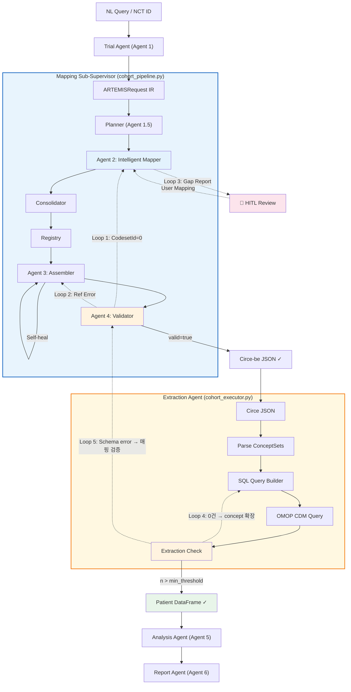

# RFC-005: Pipeline Feedback Loops (Mapping Sub-Supervisor + Extraction Agent)

**상태**: 검토 중  
**날짜**: 2026-02-18  
**제안자**: @kyh

## 1. 가설 및 목표

### 아키텍처 인식: 두 개의 Sub-Supervisor

ARTEMIS 파이프라인은 두 개의 Sub-Supervisor로 구성된다:

| Sub-Supervisor                                    | 역할                           | 하위 에이전트                                    |
| ------------------------------------------------- | ------------------------------ | ------------------------------------------------ |
| **Mapping Sub-Supervisor** (`cohort_pipeline.py`) | NL → Circe JSON                | Planner, Agent 2, Consolidator, Agent 3, Agent 4 |
| **Extraction Agent** (`cohort_executor.py`)       | Circe JSON → Patient DataFrame | CohortExecutor, OMOPConnector                    |

현재 **모든 에이전트가 순차적(linear)**으로 실행되며, 오류 발견 시 되돌아가는 메커니즘이 없다.

### 핵심 가설

> 두 Sub-Supervisor에 Validation-driven retry loop를 도입하면:
>
> 1. Mapping: first-pass success rate ~70% → 90%+
> 2. Extraction: silent fallback 제거 → 실패 원인 진단 + 자동 수정

### 성공 측정 기준

| 지표                                 | 현재           | 목표              |
| ------------------------------------ | -------------- | ----------------- |
| First-pass valid rate (Agent 4 PASS) | ~70%           | 90%+              |
| CodesetId=0 오류 비율                | ~20% rules     | <5%               |
| Extraction 0건 추출 시 fallback 비율 | 100% synthetic | <10%              |
| 수동 개입 필요 횟수                  | 매 실행        | HITL escalation만 |

## 2. 제안 설계 (Proposed Design)

### 2.1 전체 피드백 루프 아키텍처



---

### 2.2 Mapping Sub-Supervisor 피드백 루프 (Loop 1-3)

#### Loop 1: Validation → Re-mapping (Agent 4 → Agent 2)

**발동 조건**: Agent 4가 `CodesetId=0` 감지 (semantic validation)  
**동작**:

1. Agent 4가 `CodesetId=0`인 rule들의 entity_text를 수집
2. Agent 2에 해당 entity만 재매핑 요청 (slow path 강제)
3. 새 concept_ids로 Registry 업데이트
4. Agent 3 재조립 → Agent 4 재검증
5. **최대 재시도: 2회** (3-strikes rule)

```python
# cohort_pipeline.py 수정안
MAX_RETRY = 2

for attempt in range(MAX_RETRY + 1):
    circe_json = agent3.assemble(ir, registered_sets)
    validation = agent4.validate(circe_json)

    if validation.valid:
        break

    failed_entities = self._extract_failed_entities(validation, circe_json)
    if not failed_entities or attempt == MAX_RETRY:
        break

    for entity in failed_entities:
        new_ids = get_agent2().process(entity["text"])
        if new_ids:
            self._update_registry(entity, new_ids)
```

#### Loop 2: Validation → Re-assembly (Agent 4 → Agent 3)

**발동 조건**: 존재하지 않는 CodesetId 참조 감지  
**동작**: 참조 오류 rule 제거 후 재조립, 제거 목록 warning 기록

#### Loop 3: HITL Escalation (Gap Report → Human)

**발동 조건**: Loop 1 재시도 후에도 unmapped term 존재  
**동작**: Gap Report를 `PipelineResult`에 포함 → 사용자 확인

> [!IMPORTANT]
> HITL은 Supervisor Agent (LangGraph) 구현 이후에 `interrupt()` 노드로 자연스럽게 통합.
> MVP에서는 Gap Report 반환 + warning 로깅으로 대체.

> [!NOTE]
> **Agent 2 직후** 품질 검사(seed count, domain mismatch)는 [RFC-012: Post-Agent2 Supervisor](./RFC-012_Post_Agent2_Supervisor.md)로 분리. RFC-005의 Loop 1-3은 **Agent 4 이후** 재시도에 집중.

---

### 2.3 Extraction Agent 피드백 루프 (Loop 4-5)

현재 `CohortExecutor`의 문제점:

```python
# 현재 코드 — silent fallback
except Exception as e:
    print(f"⚠ Database query failed: {e}")
    return self._generate_fallback_data()  # ← 원인 진단 없이 synthetic data 반환
```

#### Loop 4: 0건 추출 → Concept 확장 재시도

**발동 조건**: `len(data) == 0` 또는 `n_target < min_threshold`  
**동작**:

1. 추출된 Concept ID로 직접 `drug_exposure` 검색하여 존재 확인
2. 없으면 → `includeDescendants` 적용하여 하위 concept까지 확장 쿼리
3. 그래도 0건이면 → concept_id가 데이터에 존재하는지 진단 쿼리 실행
4. 진단 결과를 `ExtractionResult`에 기록

```python
# cohort_executor.py 수정안
MIN_PATIENTS = 10

data = self.connector.build_analysis_dataset(...)

if len(data) < MIN_PATIENTS:
    # 진단 쿼리: concept_id가 DB에 존재하는가?
    diag = self.connector.diagnose_concepts(target_ids, comparator_ids)

    if diag["target_exists"] and not diag["target_patients"]:
        # Concept은 있지만 환자가 없다 → min_exposure_days 완화
        data = self.connector.build_analysis_dataset(
            ..., min_exposure_days=0
        )
    elif not diag["target_exists"]:
        # Concept 자체가 DB에 없다 → descendant 확장
        expanded_ids = self.connector.get_descendant_concepts(target_ids)
        data = self.connector.build_analysis_dataset(
            target_drug_ids=expanded_ids, ...
        )
```

#### Loop 5: Schema/Query Error → Mapping 재검증

**발동 조건**: SQL 실행 오류 또는 ConceptSet과 DB 스키마 불일치  
**동작**:

1. 오류 원인 분류 (DB 연결, 스키마 불일치, 잘못된 concept_id)
2. concept_id 문제면 → Agent 4에 재검증 요청
3. 스키마 문제면 → 연결 설정 확인 + 경고 반환

---

### 2.4 Agent 3 내부 Self-heal (부분 구현 → 격상)

```python
# 현재 (암묵적 필터링)
if not self._has_valid_criteria(built_rule, rule.name):
    continue  # skip silently

# 개선안 (명시적 self-heal + 로깅)
heal_result = self._self_heal_criteria(built_rule, rule.name)
if heal_result.action == "SKIP":
    self.heal_log.append(heal_result)
    continue
elif heal_result.action == "PARTIAL":
    built_rule = heal_result.healed_rule
    self.heal_log.append(heal_result)
```

### 2.5 수정 대상 파일

| 파일                              | 변경 내용                                                 |
| --------------------------------- | --------------------------------------------------------- |
| `src/pipeline/cohort_pipeline.py` | retry loop 추가, `_extract_failed_entities()`             |
| `src/agents/agent4/validator.py`  | `get_actionable_errors()` 메서드                          |
| `src/agents/agent3/assembler.py`  | `assemble_with_fallback()`, self-heal 로깅                |
| `src/agents/agent2/workflow.py`   | `process_with_retry()` (slow path 강제)                   |
| `src/pipeline/cohort_executor.py` | `execute_with_retry()`, 진단 쿼리, descendant 확장        |
| `src/analysis/omop_connector.py`  | `diagnose_concepts()`, `get_descendant_concepts()`        |
| `src/models/ir.py`                | `HealResult`, `RetryContext`, `ExtractionDiagnostic` 모델 |

## 3. 예상되는 리스크 (Potential Risks)

| 리스크                           | Impact | 대응                                  |
| -------------------------------- | ------ | ------------------------------------- |
| **무한 루프**                    | 높음   | MAX_RETRY=2 하드 리밋, 3-strikes rule |
| **실행 시간 증가**               | 중간   | 실패한 entity만 선별 재매핑           |
| **LLM 비용 증가**                | 중간   | 재시도 시 slow path만 사용            |
| **Extraction 확장 시 과다 환자** | 낮음   | descendant 확장 시 MAX_PATIENTS 제한  |
| **Self-heal 오결과**             | 중간   | heal_log로 모든 수정 추적             |

## 4. 해결되지 않은 질문 (Unresolved Questions)

1. **HITL 인터페이스**: LangGraph 없이 어떻게? → MVP: Gap Report in PipelineResult
2. **Retry 시 동의어 확장**: UMLS만? LLM 대안 term 생성?
3. **Partial success**: 10개 rule 중 2개 실패 시 partial JSON? 전체 실패?
4. **Extraction zero-hit**: descendant 확장 범위를 어디까지 허용?

## 5. 타임라인 (Timeline)

| 단계                             | 기간 | 내용                                     |
| -------------------------------- | ---- | ---------------------------------------- |
| **Phase A: Self-heal 격상**      | 1일  | Agent 3 self-heal 패턴 + 로깅            |
| **Phase B: Mapping Retry Loop**  | 2일  | `cohort_pipeline.py` Loop 1-2 구현       |
| **Phase C: Extraction Feedback** | 2일  | `cohort_executor.py` Loop 4-5, 진단 쿼리 |
| **Phase D: HITL stub**           | 1일  | Gap Report 구조화 + PipelineResult 확장  |
| **Phase E: Supervisor 통합**     | W7+  | LangGraph conditional edges로 전환       |

## 6. 검증 계획 (Verification Plan)

### 자동 테스트

```bash
# 기존 테스트 활용
cd /Users/kyh/Workspace/Broadsea/artemis && python -m pytest tests/test_agent4.py -v
cd /Users/kyh/Workspace/Broadsea/artemis && python -m pytest tests/integration/test_pipeline.py -v
```

### 신규 테스트

- `tests/test_retry_loop.py`: Mock Agent 4 → CodesetId=0 에러 → retry 후 성공
- `tests/test_self_heal.py`: Agent 3 self-heal 로깅 + partial criteria 필터링
- `tests/test_extraction_feedback.py`: Mock OMOPConnector → 0건 반환 → descendant 확장 재시도

### 수동 검증

```bash
cd /Users/kyh/Workspace/Broadsea/artemis
python -c "
from src.pipeline.cohort_pipeline import pipeline
result = pipeline.run('NCT01179048')
print(f'Valid: {result.is_valid}')
print(f'Errors: {result.validation.errors}')
"
```
