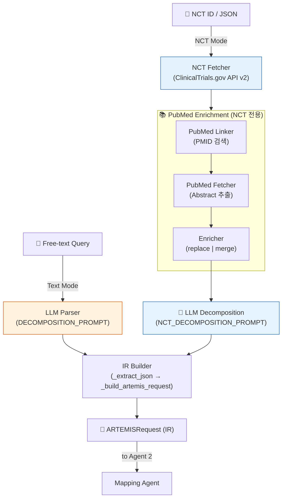

# Trial Agent (Agent 1) — 상세 설명서

> 최종 업데이트: 2026-03-04  
> 상태: Living Document — 질문에 따라 지속 업데이트

---

## 1. 개요

**Trial Agent (Agent 1)**는 ARTEMIS 파이프라인의 **최초 진입점**으로, 자연어 임상시험 프로토콜 또는 자유 텍스트 질의를 **구조화된 Internal Representation (IR)**으로 변환한다.

### 핵심 역할

```
임상시험 프로토콜 (NCT / 자유 텍스트 / PDF) → ARTEMISRequest (IR)
```

예시:

- `NCT01730534` → ClinicalTrials.gov에서 LEADER 3.4 프로토콜 가져오기 → IR
- `"Compare liraglutide vs DPP-4 in T2DM with HbA1c 7-10%"` → 직접 LLM 파싱 → IR

### 파이프라인 위치

```
User Input → Agent 1 (Trial) → [IR] → Agent 2 (Mapping) → [ConceptSets] → Agent 3 (Assembler)
```

---

## 2. 아키텍처 개요

Agent 1은 **두 가지 입력 경로**를 지원하며, 4단계 파이프라인으로 구성된다:



---

## 3. 소스 코드 구조

| 파일                                                        | 역할                                                               | 크기 |
| ----------------------------------------------------------- | ------------------------------------------------------------------ | ---- |
| [parser.py](../src/agents/agent1/parser.py)                 | **메인 오케스트레이터** — `LogicDecomposer` 클래스, 전체 흐름 제어 | 714L |
| [prompts.py](../src/agents/agent1/prompts.py)               | LLM 프롬프트 정의 (System, Decomposition, NCT, Extraction)         | 294L |
| [nct_fetcher.py](../src/agents/agent1/nct_fetcher.py)       | ClinicalTrials.gov API v2 데이터 수집 + 로컬 JSON 캐시             | 275L |
| [pubmed_linker.py](../src/agents/agent1/pubmed_linker.py)   | NCT → PubMed PMID 연결 (referencesModule + esearch)                | 118L |
| [pubmed_fetcher.py](../src/agents/agent1/pubmed_fetcher.py) | PubMed Abstract 가져오기 + eligibility regex 추출                  | 167L |
| [enricher.py](../src/agents/agent1/enricher.py)             | TrialData 보강 (replace/merge 전략)                                | 95L  |

---

## 4. 입력 모드

### 4.1 NCT Mode (`parse_nct()`)

ClinicalTrials.gov NCT ID를 입력으로 받아 프로토콜을 자동 수집한다.

```python
decomposer = LogicDecomposer()
result = decomposer.parse_nct(
    nct_id="NCT01730534",
    enrich_from_pubmed=True,       # PubMed 보강 활성화
    design_paper_pdf=None,         # PDF 직접 입력 (선택)
    papers_dir=None,               # 여러 PDF 디렉토리 (선택)
)
```

처리 흐름: `NCT Fetcher → PubMed Enrichment → LLM Decomposition → IR Builder`

### 4.2 Text Mode (`parse()`)

자유 텍스트 임상 질문을 직접 입력한다.

```python
result = decomposer.parse(
    query="Compare liraglutide vs DPP-4 inhibitors in T2DM patients..."
)
```

처리 흐름: `LLM Parser (DECOMPOSITION_PROMPT) → IR Builder`

> Text Mode는 NCT Fetcher와 PubMed Enrichment을 **건너뛰고** LLM에 바로 진입한다.

### 4.3 PDF Mode (NCT Mode 확장)

Design paper PDF를 직접 지정하거나, 디렉토리에서 자동 탐색한다.

```python
result = decomposer.parse_nct(
    nct_id="NCT01730534",
    design_paper_pdf="papers/LEADER_supplement.pdf",  # 단일 PDF
    # 또는
    papers_dir="papers/LEADER/",   # 복수 PDF 자동 탐색
)
```

**PDF 우선순위** (`_discover_pdfs`):

1. `appendix/supplement` → 가장 상세한 criteria 포함
2. `protocol`
3. `main paper` → 가장 낮은 우선순위

PDF에서 `pdftotext`로 전문 추출 후, eligibility section을 regex로 파싱한다.

---

## 5. 상세 파이프라인

### 5.1 NCT Fetcher

ClinicalTrials.gov API v2에서 시험 데이터를 수집한다.

| 기능                              | 설명                                                            |
| --------------------------------- | --------------------------------------------------------------- |
| `fetch_or_load_trial_data()`      | 캐시 확인 → miss 시 API fetch (timeout: 30s)                    |
| `_parse_protocol_to_trial_data()` | API JSON → `TrialData` Pydantic 모델 변환                       |
| `_parse_criteria_text()`          | `"Inclusion Criteria: ... Exclusion Criteria: ..."` 텍스트 분리 |
| `_parse_items()`                  | 번호/불릿 항목 파싱 (inline dash `- item1 - item2` 포함 처리)   |

**캐시**: `data/nct_cache/{nct_id}.json`에 원본 API 응답 저장

**출력**: `TrialData`

```python
class TrialData(BaseModel):
    nct_id: str
    title: str
    conditions: List[str]
    interventions: List[str]
    inclusion_criteria: List[str]
    exclusion_criteria: List[str]
    primary_outcomes: List[str]
    study_type: str
    phase: str
```

### 5.2 PubMed Enrichment (NCT 전용)

NCT API 기준만으로는 부족할 수 있어, PubMed 논문에서 더 상세한 criteria를 보강한다.

#### ① PubMed Linker — PMID 검색

| 전략                      | 메서드                     | 설명                                                |
| ------------------------- | -------------------------- | --------------------------------------------------- |
| **Strategy 1** (우선)     | `extract_pmids_from_nct()` | NCT `referencesModule`에서 직접 PMID 추출           |
| **Strategy 2** (fallback) | `search_pubmed_for_nct()`  | E-utilities `esearch`로 NCT ID 검색                 |
| **우선순위 정렬**         | `get_design_paper_pmids()` | BACKGROUND 논문 우선 (design paper > results paper) |

#### ② PubMed Fetcher — Abstract 가져오기

- E-utilities `efetch`로 XML abstract 가져오기
- `<ArticleTitle>`, `<AbstractText>` 파싱
- `extract_eligibility_from_text()`: Regex 기반 inclusion/exclusion 섹션 추출

#### ③ Enricher — 기준 보강

| 전략        | 로직                                                                                | 기본값    |
| ----------- | ----------------------------------------------------------------------------------- | --------- |
| **replace** | `_pick_richer()` — 더 많은 쪽 사용                                                  | ✅ 기본값 |
| **merge**   | `_merge_criteria()` — `SequenceMatcher` 유사도 ≥ 0.7이면 중복으로 판단, 나머지 합침 |           |

### 5.3 LLM Decomposition

NCT Mode와 Text Mode 모두 최종적으로 LLM을 호출하여 구조화된 IR을 생성한다.

#### 프롬프트 구조

| 프롬프트                   | 용도                                                                         |
| -------------------------- | ---------------------------------------------------------------------------- |
| `SYSTEM_PROMPT`            | 공통 시스템 프롬프트 — OMOP 도메인 레퍼런스 + Clinical Criteria Patterns A-D |
| `DECOMPOSITION_PROMPT`     | Text Mode용 — 자유 텍스트 → JSON                                             |
| `NCT_DECOMPOSITION_PROMPT` | NCT Mode용 — title/conditions/interventions/outcomes/criteria → JSON         |

#### Clinical Criteria Patterns (C2Q-informed)

| 패턴          | 설명                                    | 예시                                                   |
| ------------- | --------------------------------------- | ------------------------------------------------------ |
| **Pattern A** | Lab test range → **TWO** rules로 분리   | `HbA1c 7-10%` → `≥7%` (PRESENCE) + `≥10%` (ABSENCE)    |
| **Pattern B** | Simple threshold → 단일 rule            | `eGFR ≥ 30` → PRESENCE with value_constraint           |
| **Pattern C** | `"No prior X"` → ABSENCE                | `No prior MI` → `logic_type: "ABSENCE"`                |
| **Pattern D** | `"History of X"` → PRESENCE (all prior) | `History of stroke` → `window: {start: -9999, end: 0}` |

#### 주요 LLM 지시사항

1. `value_constraint`는 Measurement criteria에 **필수**
2. Comparator와 Target은 **같은 inclusion/exclusion rules** 공유 (primary_criteria만 다름)
3. 행정적 기준 (e.g., "informed consent")은 **스킵**
4. Drug entity_text에 구체적 약물명이 있으면 **원문 그대로** 유지

### 5.4 IR Builder

LLM 응답에서 JSON을 추출하고 `ARTEMISRequest`를 구성한다.

| 단계 | 메서드                          | 역할                                                                    |
| ---- | ------------------------------- | ----------------------------------------------------------------------- |
| 1    | `_extract_json()`               | LLM 응답에서 JSON 블록 추출 + validation                                |
| 2    | `_build_artemis_request()`      | target + comparator + outcome 구성                                      |
| 3    | `_build_cohort_definition()`    | PrimaryCriteria + inclusion/exclusion + ExitStrategy                    |
| 4    | `_build_criteria()`             | domain, entity_text, logic_type, window, value_constraint, sub_criteria |
| 5    | `_validate_measurement_rules()` | Measurement에 value_constraint 누락 시 경고 (C2Q 3.0 inspired)          |

#### 정규화 처리

| 메서드                          | 역할                                                                      |
| ------------------------------- | ------------------------------------------------------------------------- |
| `_normalize_entity_text()`      | 일반적인 entity_text 정규화                                               |
| `_normalize_drug_entity_text()` | Drug entity_text에서 괄호 내용/불필요한 일반화 제거 (Agent 2 과확장 방지) |
| `_normalize_operator()`         | 연산자 문자열 정규화 (`>=` → `gte`, `<` → `lt` 등)                        |

---

## 6. 출력 (ARTEMISRequest)

```python
class ARTEMISRequest(BaseModel):
    target: CohortDefinition
    comparator: CohortDefinition
    outcome: CohortOutcome

class CohortDefinition(BaseModel):
    primary_criteria: PrimaryCriteria     # 치료/대조 약물 정의
    inclusion_rules: List[Criteria]       # 포함 기준
    exclusion_rules: List[Criteria]       # 제외 기준
    exit_strategy: str = "OBSERVATION_END"

class Criteria(BaseModel):
    name: str                              # 규칙 이름
    domain: str                            # Condition, Drug, Measurement, ...
    entity_text: Optional[str]             # 임상 용어 텍스트
    logic_type: Literal["PRESENCE", "ABSENCE"]
    window: Optional[TemporalWindow]       # 시간 제약 (days)
    value_constraint: Optional[ValueConstraint]  # 측정값 제약
    sub_criteria: List[Criteria] = []      # 복합 기준
    group_type: Literal["ALL", "ANY"] = "ALL"
```

---

## 7. 외부 의존성

| 시스템                        | 용도                          | 필수 여부              |
| ----------------------------- | ----------------------------- | ---------------------- |
| **LLM** (Claude/GPT)          | IR 생성 (Decomposition)       | ✅ 필수                |
| **ClinicalTrials.gov API v2** | NCT 프로토콜 수집             | ⚠️ NCT Mode만          |
| **PubMed E-utilities**        | PMID 검색 + Abstract 가져오기 | ⚠️ 선택 (enrichment용) |
| **pdftotext**                 | PDF에서 텍스트 추출           | ⚠️ PDF Mode만          |

---

## 8. 핵심 설계 결정 (ADR 참조)

| 결정                        | 문서                                                   | 요약                                 |
| --------------------------- | ------------------------------------------------------ | ------------------------------------ |
| C2Q Agent 1 Prompt Strategy | [ADR-014](./adr/ADR-014_C2Q_Agent1_Prompt_Strategy.md) | C2Q 논문 기반 프롬프트 설계          |
| Agent 1 Role Reduction      | [ADR-017](./adr/ADR-017_Agent1_Role_Reduction.md)      | Agent 1 역할 축소 (매핑은 Agent 2로) |

---

## 9. 알려진 제한사항

1. **Polarity 손실**: LLM이 exclusion_rules에도 `logic_type: "PRESENCE"`를 출력하는 경우 있음 → `force_logic_type="ABSENCE"` guardrail 적용
2. **NCT API 기준 불완전**: ClinicalTrials.gov 기준이 design paper 대비 누락이 많음 → PubMed/PDF enrichment으로 보완
3. **JSON 파싱 불안정**: LLM이 가끔 invalid JSON을 출력 → `_extract_json()`에서 regex 기반 복구

---

## 10. FAQ

> 이 섹션은 질문에 따라 지속 업데이트됩니다.

_(아직 질문이 없습니다. 질문해주시면 여기에 추가합니다.)_

---

## 관련 문서

- [Trial Agent Diagram Guide](./trial_agent_diagram_guide.md) — 아키텍처 다이어그램 작성 가이드
- [Mapping Agent 설명서](./mapping_agent_explanation.md) — Agent 2 상세 설명
- [MOC](./MOC.md) — 전체 문서 목록
